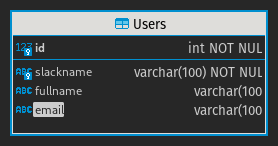
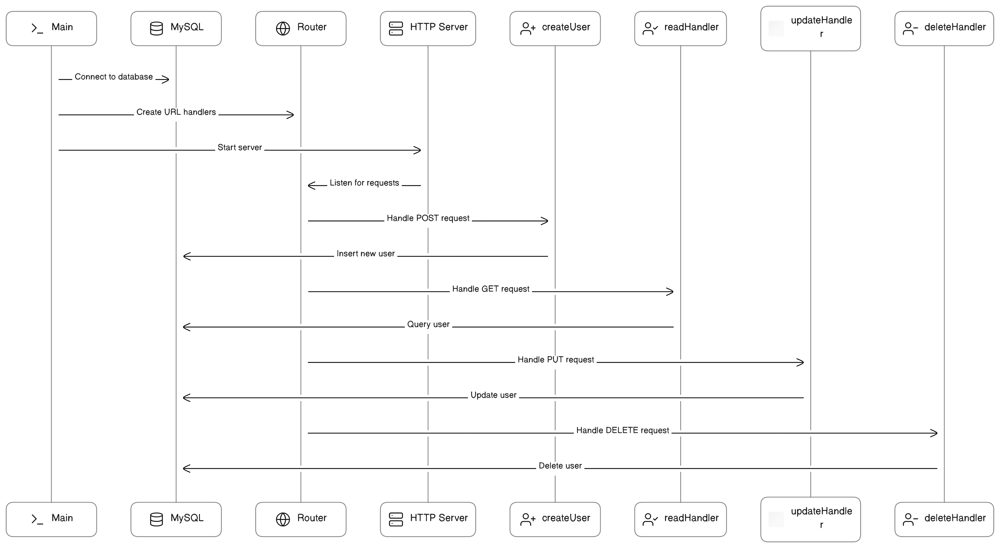

# API Documentation

## Table of Contents

1. Introduction
2. API Usage
   - 2.1 How to Call the API
   - 2.2 Supported CRUD Operations
3. Request and Response Formats
   - 3.1 Request Formats
   - 3.2 Response Formats
4. Sample API Calls
5. Setting Up and Running the API in a Container
   - 5.1 Environment Variables
   - 5.2 Docker Container Setup
6. UML Diagram
7. ER Diagram

---

## 1. Introduction

This document provides documentation for my HNGx Person Go API project. The API serves as a CRUD (Create, Read, Update, Delete) interface for interacting with a Person Object in a MySQL database. This API is written in Go.

## 2. API Usage

### 2.1 How to Call the API

The API can be accessed via HTTP requests. It exposes endpoints for various CRUD operations.

Sample API base URL: `http://example.com/api`

Current [Active] base URL: `https://hnx2.obimadu.pro/api`

### 2.2 Supported CRUD Operations

The API supports the following CRUD operations:

- **Create**: `POST /`
- **Read**: `GET /{name}`
- **Update**: `PATCH /{name}`
- **Delete**: `DELETE /{name}`

## 3. Request and Response Formats

### 3.1 Request Formats

- **Create Request** (POST /)
  - Body (form-data):
    - name (string, required, unique): This is the slackname of the User.
    - fullname (string, optional): Full Name of User.
    - email (string, optional): Email address of User.

- **Get Request** (GET /{name})
  - Body (no-data)

- **Update Request** (PATCH /{name})
  - Body (form-data):
    - name (string, required, unique): This is the slackname of the User.
    - fullname (string, optional): Full Name of User.
    - email (string, optional): Email address of User.

- **Delete Request** (DELETE /{name})
  - Body (no-data)

### 3.2 Response Formats

- **Successful Response** (Status Code: 200 OK)
  - Body (Text):
    - id (int): User ID.
    - slackname (string): Slackname of User.
    - fullname (string): Full Name of user.
    - email (string): Email of user.

- **Error Responses** (Status Codes: 2xx or 5xx)
  - Body (Text):
    - error (string): Error message.

  - 204 & 206 codes are returned on incorrect inputs/requests. E.g. When {name} is not unique, or GET, UPDATE & DELETE requests are made on a non-existent {name}.
  - 5xx codes are returned on server errors.

## 4. Sample API Calls

Here are some sample API calls:

- **Create Resource**
  - Request:
    ```http
    POST https://hngx2.obimadu.pro/api
    Content-Type: multitype/form-data

      "name": "obimadu",
      "fullname": "Obi Madu"
      "email": "mail@obimadu.pro"
    ```
  - Response (Status Code: 200 OK):
    ```text
    User with slackname:obimadu created succesfully!
    ```

- **Read Resource**
  - Request:
    ```http
    GET https://hngx2.obimadu.pro/api/obimadu
    ```
  - Response (Status Code: 200 OK):
    ```text
      "id": 1,
      "slackname": "obimadu",
      "fullname": "Obi Madu"
      "email": "mail@obimadu.pro"
    ```

- **Update Resource**
  - Request:
    ```http
    PATCH https://hngx2.obimadu.pro/api/obimadu
    Content-Type: multitype/form-data

      "name": "obimaduNew",
      "fullname": "Obi Madu New"
      "email": "mail@obimadu.pro"
    ```
  - Response (Status Code: 200 OK):
    ```text
    User with slackname:obimadu Updated to obimaduNew succesfully!
    ```

- **Delete Resource**
  - Request:
    ```http
    DELETE https://hngx2.obimadu.pro/api/obimadu
    ```
  - Response (Status Code: 200 OK)
    ```text
    User with slackname:obimaduNew deleted succesfully!
    ```

## 5. Setting Up and Running the API in a Container

### 5.1 Environment Variables

To run the API in a container, you'll need to set the following environment variables:

- `MYSQL_HOST`: Hostname (IPaddress:Port) of the MySQL database server.
- `MYSQL_USERNAME`: MySQL database username.
- `MYSQL_PASSWORD`: MySQL database password.
- `MYSQL_DBNAME`: Name of the MySQL database.

### 5.2 Docker Container Setup

1. Build the Docker image:
   
   ```sh
   docker build -t your-api-image .

   docker run -d -p 8080:8080 \
   -e MYSQL_HOST=your-db-host \
   -e MYSQL_USERNAME=your-db-username \
   -e MYSQL_PASSWORD=your-db-password \
   -e MYSQL_DBNAME=your-db-name \
   --name your-container-name \
   your-api-image

The API should now be accessible at http://localhost:8080

## 6. ER Diagram
For Guidance creating and setting up the Database for the API, utilize the E-R Diagram below.

[Link to ER Diagram](./ER_diag.png)



## 7. API UML Diagram

[Link to UML Diagram](./UML_diag.png)


